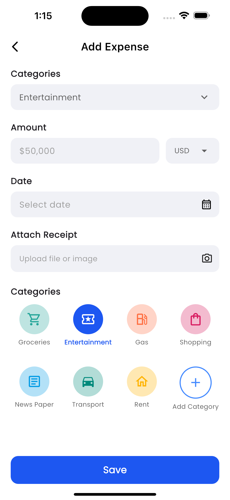
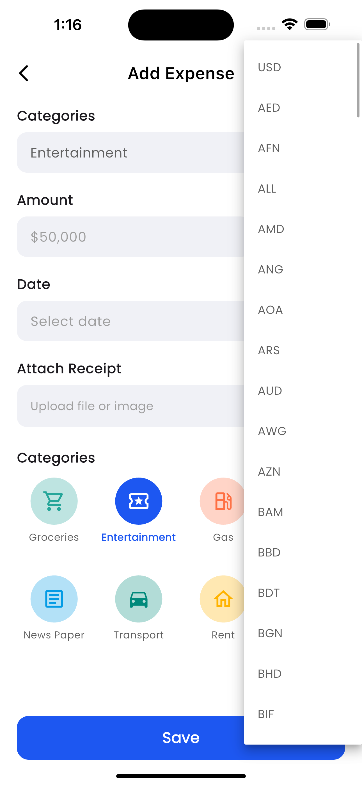

# Expense Tracker App

A modern Flutter expense tracking application built with clean architecture principles, featuring real-time currency conversion, local data persistence, and a beautiful UI.

## 📱 Overview

This expense tracker app allows users to:

- Add and track expenses with multiple currencies
- View real-time balance, income, and expense summaries
- Filter expenses by date range and categories
- Attach images to expense records
- Convert currencies automatically using live exchange rates
- Store data locally for offline access

## 🏗️ Architecture & Structure

The app follows **Clean Architecture** principles with a feature-based folder structure:

```
lib/
├── core/                    # Shared components
│   ├── constants/          # Enums and constants
│   ├── di/                # Dependency injection
│   ├── theme/             # App theming
│   └── transitions/       # Page transitions
├── features/              # Feature modules
│   ├── currency/          # Currency conversion feature
│   ├── expenses/          # Expense management feature
│   └── file_picker/       # File/image picking feature
└── main.dart              # App entry point
```

### Architecture Layers:

1. **Presentation Layer** (`presentation/`)

   - BLoC/Cubit for state management
   - UI widgets and screens
   - Event handling

2. **Domain Layer** (`domain/`)

   - Business logic and entities
   - Use cases (interactors)
   - Repository interfaces

3. **Data Layer** (`data/`)
   - Repository implementations
   - Data sources (local/remote)
   - Data models

## 🔄 State Management Approach

The app uses **BLoC (Business Logic Component)** pattern with the `flutter_bloc` package:

### Key BLoCs:

- **ExpenseBloc**: Manages expense list, filtering, and pagination
- **AddExpenseCubit**: Handles expense creation form state
- **CurrencyBloc**: Manages currency conversion rates
- **FilePickerBloc**: Handles file/image selection

### State Management Benefits:

- Predictable state changes
- Separation of business logic from UI
- Easy testing and debugging
- Reactive UI updates

## 🌐 API Integration

### Currency Exchange API

- **Provider**: ExchangeRate-API (v6)
- **Endpoint**: `https://v6.exchangerate-api.com/v6/{API_KEY}/latest/USD`
- **Purpose**: Real-time currency conversion rates
- **Caching**: Implemented with Hive for offline access

### API Implementation Details:

```dart
// Remote data source
class CurrencyRemoteDataSourceImpl implements CurrencyRemoteDataSource {
  Future<Map<String, dynamic>> getExchangeRates() async {
    final response = await dio.get(_baseUrl);
    if (response.statusCode == 200 && response.data['result'] == 'success') {
      return Map<String, dynamic>.from(response.data['conversion_rates']);
    }
    throw Exception('Failed to fetch exchange rates');
  }
}
```

### Error Handling:

- Network error handling with try-catch blocks
- Graceful fallback to cached data
- User-friendly error messages

## 📄 Pagination Strategy

The app implements **local pagination** using Hive database:

### Pagination Implementation:

- **Page Size**: 10 items per page
- **Strategy**: Local pagination (no API pagination needed)
- **Storage**: Hive NoSQL database
- **Performance**: Efficient filtering and sorting

### Key Features:

```dart
// Pagination parameters
class GetExpensesParams {
  final int page;
  final int pageSize;
  final DateTime? from;
  final DateTime? to;
  final String? category;
}

// Local pagination logic
final start = (params.page - 1) * params.pageSize;
final end = start + params.pageSize;
return all.sublist(start, end > all.length ? all.length : end);
```

### Benefits:

- Fast loading times
- Offline functionality
- Smooth scrolling experience
- Efficient memory usage

## 🎨 UI/UX Features

### Design System:

- **Primary Color**: `#516DEB` (Blue)
- **Background**: `#F9FBFA` (Light Gray)
- **Typography**: Google Fonts integration
- **Icons**: Material Design Icons

### Key UI Components:

- **Balance Card**: Real-time balance display with income/expense summary
- **Expense List**: Swipeable expense items with category icons
- **Add Expense Screen**: Form with image attachment capability
- **Filter Widget**: Date range and category filtering
- **Floating Action Button**: Quick expense addition

### Responsive Design:

- Adaptive layouts for different screen sizes
- Proper spacing and typography scaling
- Touch-friendly interface elements

## 🛠️ Dependencies

### Core Dependencies:

```yaml
flutter_bloc: ^9.1.1 # State management
hive: ^2.2.3 # Local database
dio: ^5.8.0+1 # HTTP client
get_it: ^8.0.3 # Dependency injection
intl: ^0.20.2 # Internationalization
image_picker: ^1.1.2 # Image selection
file_picker: ^10.2.0 # File selection
flutter_svg: ^2.2.0 # SVG support
google_fonts: ^6.2.1 # Custom fonts
uuid: ^4.5.1 # Unique identifiers
```

### Development Dependencies:

```yaml
flutter_lints: ^6.0.0 # Code linting
build_runner: ^2.5.3 # Code generation
mockito: ^5.4.4 # Testing
bloc_test: ^10.0.0 # BLoC testing
hive_generator: ^2.0.1 # Hive code generation
```

## 🚀 How to Run the Project

### Prerequisites:

- Flutter SDK (3.32.4 or higher)
- Dart SDK
- Android Studio / VS Code
- iOS Simulator (for iOS development)
- Android Emulator (for Android development)

### Version Management:

This project uses specific Flutter and Dart SDK versions for consistency:

- **Flutter Version**: `3.32.4`
- **Dart Version**: `3.8.1`
- **SDK Constraints**: `^3.8.1`

**Using FVM (Flutter Version Management) - Recommended:**

```bash
# Install FVM
dart pub global activate fvm

# Use project Flutter version
fvm use

# Run with FVM
fvm flutter run
```

**Manual Setup:**

```bash
# Check your Flutter version
flutter --version

# If you need to switch versions, use
flutter channel stable
flutter upgrade
```

### Setup Instructions:

1. **Clone the repository:**

   ```bash
   git clone https://github.com/ahmedsabahi/inovola_flutter_task.git
   cd inovola_flutter_task
   ```

2. **Install dependencies:**

   ```bash
   flutter pub get
   ```

3. **Generate code (for Hive models):**

   ```bash
   flutter packages pub run build_runner build
   ```

4. **Run the app:**
   ```bash
   flutter run
   ```

### Platform-Specific Setup:

#### Android:

- Ensure Android SDK is installed
- Create/start an Android emulator
- Run: `flutter run -d android`

**Android Release Build:**

The project includes a pre-configured keystore for release builds. To build a signed APK:

```bash
# Build signed APK
flutter build apk --release

# Build signed App Bundle (recommended for Play Store)
flutter build appbundle --release
```

**Keystore Configuration:**

The project includes a pre-configured keystore for Android release builds:

**File Structure:**

```
android/
├── app/
│   ├── upload-keystore.jks    # Keystore file (not in git)
│   └── proguard-rules.pro     # ProGuard rules for release
├── key.properties.template    # Template for local setup
└── key.properties            # Keystore credentials (not in git)
```

**Security Considerations:**

- Keystore file is excluded from version control
- `key.properties` file is excluded from version control
- For production apps, use stronger passwords
- Consider using Google Play App Signing
- Store credentials in environment variables for CI/CD

**Local Development:**

```bash
# Copy template and configure
cp android/key.properties.template android/key.properties
# Edit android/key.properties with your credentials
```

**CI/CD Setup:**

The CI/CD pipeline uses GitHub Secrets for secure keystore configuration:

1. **Required Secrets** (set in GitHub repository settings):

   - `KEYSTORE_BASE64`: Base64 encoded keystore file
   - `KEYSTORE_FILE`: Path to keystore file (`app/upload-keystore.jks`)
   - `KEY_ALIAS`: Keystore alias (`upload`)
   - `STORE_PASSWORD`: Keystore password
   - `KEY_PASSWORD`: Key password

2. **Generate Base64 keystore**:

   ```bash
   base64 -i android/app/upload-keystore.jks | pbcopy
   ```

3. **Set GitHub Secrets**:
   - Go to your repository → Settings → Secrets and variables → Actions
   - Add each secret with the corresponding value

**Automated Setup (Recommended):**

Use the provided script to generate all required values:

```bash
# Run the keystore preparation script
./scripts/prepare-keystore.sh

# This will output all the values you need for GitHub Secrets
```

#### iOS:

- Install Xcode
- Open iOS Simulator
- Run: `flutter run -d ios`

#### Web:

- Run: `flutter run -d chrome`

## 🧪 Testing

The project includes comprehensive testing with **99 test cases** covering all major functionality.

### Test Structure:

```
test/
├── features/
│   ├── currency/           # Currency feature tests
│   │   └── services/
│   │       └── currency_calculation_service_test.dart
│   └── expenses/          # Expense feature tests
│       ├── data/
│       │   └── datasources/
│       │       └── expense_local_datasource_test.dart
│       ├── presentation/
│       │   ├── bloc/
│       │   │   └── expense_bloc_test.dart
│       │   └── widgets/
│       │       └── expense_list_item_test.dart
│       └── service/
│           ├── expense_calculation_service_test.dart
│           ├── expense_validation_service_test.dart
│           └── expense_validation_service_test.dart
└── widget_test.dart       # Widget tests
```

### Running Tests:

```bash
# Run all tests
flutter test

# Run with coverage
flutter test --coverage

# Run specific test file
flutter test test/features/expenses/service/expense_validation_service_test.dart

# Run tests with verbose output
flutter test --verbose
```

### Test Coverage:

The project includes comprehensive test coverage for:

- **Validation Logic**: Amount and date validation with edge cases
- **Business Logic**: Expense calculations and currency conversions
- **Data Layer**: Local data source operations
- **State Management**: BLoC/Cubit behavior testing
- **UI Components**: Widget testing for key components

### Example Test:

```dart
test('should return null for valid positive amount', () {
  final result = ExpenseValidation.validateAmount('100.50');
  expect(result, isNull);
});

test('should return error for negative amount', () {
  final result = ExpenseValidation.validateAmount('-100');
  expect(result, equals('Amount must be greater than zero'));
});
```

## 🔄 CI/CD Pipeline

This project uses **GitHub Actions** for continuous integration and deployment with comprehensive automation.

### Version Management in CI/CD:

- **Flutter Version**: `3.32.4`
- **Dart Version**: `3.8.1`
- **Java Version**: `17` (for Android builds)
- **Platforms**: Ubuntu, macOS

### Workflows Overview:

#### 1. **CI Pipeline** (`.github/workflows/ci.yml`)

**Triggers:** Push to `main`/`develop`, Pull Requests

**Jobs:**

- **Analyze:** Code analysis and linting
- **Test:** Unit tests with coverage reporting
- **Build Multi-Platform:** Android, iOS, Web builds

**Version Configuration:**

```yaml
- name: Setup Flutter
  uses: subosito/flutter-action@v2
  with:
    flutter-version: "3.32.4"
    channel: "stable"
```

#### 2. **CD Pipeline** (`.github/workflows/cd.yml`)

**Triggers:** Release publication

**Jobs:**

- **Deploy Android:** APK and App Bundle for release
- **Deploy Web:** Web build archive

#### 3. **PR Check** (`.github/workflows/pr-check.yml`)

**Triggers:** Pull Requests

**Checks:**

- Code analysis and formatting
- Unit tests with coverage
- Dependency validation

#### 4. **Dependency Check** (`.github/workflows/dependency-check.yml`)

**Triggers:** Weekly schedule, Manual dispatch

**Features:**

- Security audits
- Outdated dependency detection
- Dependency tree analysis

#### 5. **Firebase Deploy** (`.github/workflows/firebase-deploy.yml`)

**Triggers:** Push to `main`, Manual dispatch

**Purpose:** Deploy web version to Firebase Hosting

### Setup Requirements:

#### Repository Secrets:

```bash
# Firebase Deployment (Optional)
FIREBASE_SERVICE_ACCOUNT=base64_encoded_service_account_json
FIREBASE_PROJECT_ID=your_firebase_project_id

# Code Coverage (Optional)
CODECOV_TOKEN=your_codecov_token
```

#### Branch Protection Rules:

- Require status checks to pass before merging
- Require branches to be up to date
- Require pull request reviews

### Key Features:

#### 🔒 **Security & Quality:**

- Automated code analysis and linting
- Security vulnerability scanning
- Dependency audit and updates
- Code coverage reporting

#### 🚀 **Multi-Platform Support:**

- **Android:** APK and App Bundle builds
- **iOS:** iOS app builds (manual code signing for App Store)
- **Web:** Web application builds

#### 📦 **Artifact Management:**

- Build artifacts uploaded to GitHub Actions
- Release assets automatically attached to GitHub releases
- Dependency reports archived for review

#### ⚡ **Performance Optimizations:**

- Dependency caching for faster builds
- Parallel job execution
- Optimized build steps

### Release Process:

1. **Create Release:**

   ```bash
   git tag v1.0.0
   git push origin v1.0.0
   ```

2. **GitHub Release:**

   - Create new release on GitHub
   - Tag with version (e.g., `v1.0.0`)
   - Publish release

3. **Automated Deployment:**
   - CD workflow triggers automatically
   - Builds for all platforms
   - Uploads artifacts to release

### Monitoring & Maintenance:

#### Workflow Monitoring:

- Check GitHub Actions tab for workflow status
- Review build logs for issues
- Monitor artifact uploads

#### Performance Tracking:

- Build time optimization
- Cache hit rates
- Dependency update frequency

#### Security Updates:

- Weekly dependency audits
- Automated vulnerability scanning
- Security patch notifications

## 🔧 Configuration

### Environment Variables:

- Currency API key is hardcoded in the remote data source
- Consider moving to environment variables for production

### Database Configuration:

- Hive boxes are automatically initialized
- No additional configuration required

### Android Keystore Configuration:

The project includes a pre-configured keystore for Android release builds:

**File Structure:**

```
android/
├── app/
│   ├── upload-keystore.jks    # Keystore file (not in git)
└── key.properties            # Keystore credentials (not in git)
```


**Security Considerations:**

- Keystore file is excluded from version control
- `key.properties` file is excluded from version control
- For production apps, use stronger passwords
- Consider using Google Play App Signing
- Store credentials in environment variables for CI/CD

**CI/CD Configuration:**
The pipeline uses GitHub Secrets to securely handle keystore credentials:

- `KEYSTORE_BASE64`: Base64 encoded keystore file
- `KEYSTORE_FILE`: Path to keystore file
- `KEY_ALIAS`: Keystore alias
- `STORE_PASSWORD`: Keystore password
- `KEY_PASSWORD`: Key password

**Build Commands:**

```bash
# Debug build (unsigned)
flutter build apk --debug

# Release build (signed)
flutter build apk --release

# App Bundle for Play Store
flutter build appbundle --release
```

## 📱 Screenshots






### Main Features:

1. **Home Screen**: Balance overview with recent expenses
2. **Add Expense**: Form with category selection and image attachment
3. **Expense List**: Swipeable list with filtering options
4. **Balance Card**: Real-time financial summary

## ⚖️ Trade-offs & Assumptions

### Design Decisions:

1. **Local-First Architecture**

   - ✅ Pros: Offline functionality, fast performance
   - ❌ Cons: No cloud sync, data loss risk

2. **Hive Database**

   - ✅ Pros: NoSQL, type-safe, efficient
   - ❌ Cons: Limited query capabilities compared to SQL

3. **BLoC Pattern**

   - ✅ Pros: Predictable state, testable
   - ❌ Cons: More boilerplate code

4. **Single Currency API**
   - ✅ Pros: Simple implementation, reliable
   - ❌ Cons: Single point of failure, rate limits

### Assumptions:

- Users have stable internet for currency conversion
- Local storage is sufficient for expense data
- Single user per device (no multi-user support)
- Currency conversion happens at time of expense creation

## 🐛 Known Issues & Limitations

### Current Limitations:

1. **No Cloud Sync**: Data is stored locally only
2. **Single Currency API**: No fallback exchange rate provider
3. **No Data Export**: Cannot export expense data
4. **Limited Categories**: Fixed set of expense categories
5. **No Budget Features**: No budget setting or tracking
6. **No Recurring Expenses**: Cannot set up recurring transactions

### Potential Improvements:

1. **Cloud Integration**: Add Firebase/backend sync
2. **Multiple Currency APIs**: Implement fallback providers
3. **Data Export**: CSV/PDF export functionality
4. **Custom Categories**: User-defined expense categories
5. **Budget Management**: Monthly/yearly budget tracking
6. **Recurring Expenses**: Automated expense creation
7. **Data Backup**: Cloud backup and restore functionality

## 🤝 Contributing

1. Fork the repository
2. Create a feature branch
3. Make your changes
4. Add tests for new functionality
5. Ensure all tests pass
6. Submit a pull request

### Development Guidelines:

- Follow the existing code style and architecture
- Write tests for new features
- Update documentation as needed
- Ensure all CI checks pass

## 📄 License

This project is licensed under the MIT License - see the LICENSE file for details.

---

**Built with ❤️ using Flutter and Clean Architecture principles**
